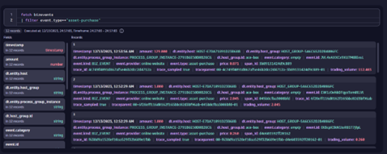

## Lab 1: Creating Business Rules 

This lab will show you how to *create* and *validate* **business rules**. 

### Theory of the Configuration 

* **Triggers**: *Define* conditions to trigger **business events** from incoming **web requests**. **Triggers** are connected by **AND** logic per capture rule. If you set multiple *trigger rules*, **all** of them *need* to be fulfilled to *capture* a **business event**. (Mandatory) 

* **Event Metadata**: 
    * **Provider**: a server, a software tool, a third-party integration (Mandatory) 
    * **Type**: purchase, login, etc. (Mandatory) 
    * **Category**: reference from ITIL (Optional) 

* **Event Data**: extract data from the transaction 

#### Example Result 

  


### 1.1 OneAgent rule Configuration
##### Configure
1.	*Open* "**Settings**"
2.	*Open* "**Business Analytics**" menu group
3.	*Click* on "**OneAgent**"
4.	*Click* on "**Add new capture rule**"
5.	For field "**Rule name**", *copy* and *paste*:

```
Asset purchase
```

##### Configure Trigger
1.	*Click* on "**Add trigger**"
2.	For "**Data source**", *select* "**Request - Path**"
3.	For "**Operator**", *select* "**equals**"
4.	For "**Value**", *copy* and *paste*:

```
/v1/trade/long/buy
```

##### Configure metadata (provider)
1.	For "**Event provider data source**", *select* "**Fixed value**"
2.	For "**Event provider fixed value**", *copy* and *paste*:

```
online-website
```

##### Configure metadata (type)
1.	For "**Event type data source**", *select* "**Fixed value**"
2.	For "**Event type fixed value**", *copy* and *paste*:

```
asset-purchase
```

##### Configure additional data (price)
1.	*Click* on "**Add data field**"
2.	For "**Data source**", make sure that "**Request - Body**" is *selected*
3.	For "**Field name**" and "**Path**", *copy* and *paste*:

```
price
```

#### Configure additional data (amount) 

1. *Click* on "**Add data field**" 
2. For "**Data source**", make sure that "**Request - Body**" is *selected* 
3. For "**Field name**" and "**Path**", *copy* and *paste*: 
   
```
amount 
```

**At the bottom of the screen, click "Save changes"**

### 1.2 Notebook
1.	*Open* "**Notebooks**"
2.	*Create* a **new notebook**
3.	*Click* on the "**+**" to add a **new section**
4.	*Click* on "**Query Grail**"
5.	Copy and *paste* the *query*:

``` 
fetch bizevents 
| filter event.type=="asset-purchase"
```
### 1.3 OpenPipeline Pipeline Configuration
1. *Open* "**OpenPipeline**" 
2. *Click* on "**Business events**" menu group
3. *Click* on "**Pipelines**"
4. *Create* a **new pipeline**
5. *Rename* the pipeline:

```
Asset purchase
``` 

### 1.4 OpenPipeline Processing Rule Configuration
1.	*Open* "**OpenPipeline**"
2.	*Click* on "**Business events**" menu group
3.	*Click* on "**Pipelines**"
4.	*Open* the "**Asset purchase**" pipeline
5.	*Open* the "**Processing**" tab
6.	From the processor dropdown menu, *Select* "**DQL**" 
7.	*Name* the new processor, *copy* and *paste*:

```
Calculate revenue
```

8.	For "**Matching condition**", leave set to **true**
9.	For "**DQL processor definition**", *copy* and *paste*:

```
fieldsAdd trading_volume = price*amount 
```
**At the top right of the screen, click "*Save*"**

### 1.5 OpenPipeline Metric Extraction Configuration
1.	*Open* "**OpenPipeline**"
2.	*Click* on "**Business events**" menu group
3.	*Open* "**Asset purchase**" pipeline
4.	*Click* on "**Metric extraction**"
5.	*Create* a "**new processor**" that's a "**Value metric**"
6.	For "**Name**", *copy* and *paste*:

```
Calculate revenue
```

7.	For "**Matching condition**", *leave* as **true**
8.	In "**Field extraction**", *copy* and *paste*:

```
trading_volume
```

9. For "**Metric key**", *copy* and *paste*:

```
easytrade.trading_volume 
```

**At the top right of the screen, click "*Save*"**

### 1.6 OpenPipeline Bucket Assignment Rule Configuration
1.	*Open* "**OpenPipeline**"
2.	*Click* on "**Business events**" menu group
3.	*Click* on "**Pipelines**"
4.	*Open* "**Asset purchase**" pipeline
5.	*Click* on "**Storage**"
6.	*Create* a new processor in "**Bucket assignment**"
7.	For "**Name**", *copy* and *paste*:

```
Asset Purchase
```

8. For "**Matcher**", leave set to "**true**"
9. For "**Storage**", *Select* "**Business Events**"

**At the top right of the screen, click "*Save*"**

### 1.7 OpenPipeline Dynamic Routing

1. *Open* "**OpenPipeline**"
2. *Click* on "**Business events**" menu group
3. *Click* on "**Dynamic routing**"
4. *Create* a *new Dynamic route*
5. For "**Name**", *copy* and *paste*: 

```
Asset Purchase 
```

6. For "**Matching condition**", *copy* and *paste*:

```
event.type=="asset-purchase" 
```

7. *Select* "**Asset purchase**" pipeline
8. *Click* "**Add**" 

**At the top right of the screen, click "*Save*"**

### 1.8 Queries
##### Validate new attribute
1.	From the menu, *open* "**Notebooks**"
2.	*Click* on the "**+**" to add a new section
3.	*Click* on "**Query Grail**"
4.	*Copy* and *paste* the **query**:

```
fetch bizevents 
| filter event.type == "asset-purchase"
| fields price, amount, trading_volume
```

##### Validate metric
1.	*Click* on the "**+**" to add a new section
2.	*Click* on "**Query Grail**"
3.	*Copy* and *paste* the **query**:

```
timeseries avg(bizevents.easytrade.trading_volume)
```

4.	*Click* on "**Run query**"
5.	*Wait* for the **first data points** to appear
